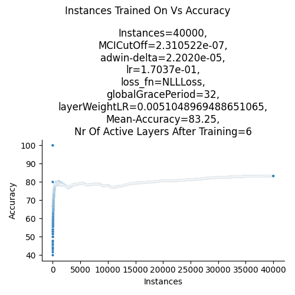

# Wir haben die falsche Loss function verwendet? 
## hinweis 1:
> laut herrn gpt macht cross entropy bereits selber ein softmax und erwartet reine logits,
> nlll loss wäre dementsprechend für unsere funktion die bessere loss function wenn wir auf die wsk jeweils den log anwenden
## quellen arbeit:

[//]: #todo (recheriere im internet)
## neue loss funktions vorschlag:
```python
import torch
from torch import nn
nr_of_classes = 4
idx_of_true_class = 1

y_pred: torch.Tensor = torch.rand(nr_of_classes)
y_true: torch.Tensor = torch.tensor(idx_of_true_class, dtype=torch.int)
nn.NLLLoss()(torch.log(y_pred), y_true)
```
## comparision of old loss vs new loss for set of hyperparameter:

[//]: #todo: (test loss functions against each other)

# Decoupeling von Learning Rate und Weight Correction Factor um LR zu senken?
## Vergleich best LR Coupled vs Best LR Decoupled

[//]: #todo: (run best LR Coupled)

[//]: #todo: (compare best coupled vs best decoupled by plot)

# Syntetic Streams Build:
## Type of Streams:
|                 Type | Agrawal  | SEA | details                                                                                                                     |  
|---------------------:|:--------:|:---------:|:----------------------------------------------------------------------------------------------------------------------------|
|             no drift | &#x2611; | &#x2611; | Function 1                                                                                                                  |  
|            one drift | &#x2611; | &#x2611; | Function 1 -> abrupt drift @ 5000 -> Function 3                                                                             |  
|         three drifts | &#x2611; | &#x2611; | Function 1 -> abrupt drift @ 5000 -> Function 3 -> abrupt drift @ 10000 -> Function 4 -> abrupt drift @ 15000 -> Function 1 |
| drift back and forth | &#x2611; | &#x2611; | Function 1 -> abrupt drift @ 5000 -> Function 3 -> abrupt drift @ 10000 -> Function 1                                       |

## Results for ADL on Types of Streams  
|                 Type | Agrawal |  SEA   |
|---------------------:|:--------|:------:|
|             no drift | 53.3%   | 54.06% |  
|            one drift | 53.54%  |  xx%   | 
|         three drifts | 56.68%  |  xx%   |
| drift back and forth | 65.71%  |  xx%   |

# Suchraum einschränken:
## 1. Versuch: einfach jeweils die drei Parameter nehmen die am besten auf EletricityTiny performed haben und sie auf Electricity testen:
### Lr:
- LinearLearningRateProgression(initial_learning_rate=1, decay_alpha=0.001)
- ExponentialLearningRateProgression(initial_learning_rate=1, decay_alpha=0.001)
- 5e-1
- 5e-2
- 1e-3
> 4 Werte weil mir eigentlich alle werte außer den letzen beiden zu hoch sind.
### MCI:
- 1e-6
- 1e-7
- 1e-8
> in tiny haben wir damit immer so um die 6-10 activen layer am Ende gehabt
### adwin-delta:
- 1e-3
- 1e-5
- 1e-7
### grace period per layer
- 4
- 8
- 16?
- None
> finding aus der isolation: je höher die grace period, desto schlechter das ergebnis
> und per layer out-performed global nach dem ich global auch anwende #-.-  
> es kann sein, dass auf mehr instanzen größere grace periods sinn machen bzw positive sind,
> weil auf den kleinen datastreams haben wir ja anscheinend nur das problem nicht schnell genug lernen zu können

# Ray Tunes:
## 1. Suchraum:
- maximal 50000
- frühester abbruch nach = 500
- anzahl stichproben = 500
- 'learner': ('vectorized', 'winning_layer', 'decoupled_lrs')
- stream: only one stream at a time
- 'lr': tune.loguniform(1e-4, 5e-1)
- 'layer_weight_learning_rate': tune.loguniform(1e-4, 5e-1),
- 'adwin-delta': tune.loguniform(1e-7, 1e-3),
- 'mci': tune.loguniform(1e-7, 1e-5),
- 'loss_fn': 'NLLLoss'
- 'grace_period': choice aus: global/layer/none in 4,8,16,32

### Ergebniss des ersten Suchraums:

- "lr": 0.17037433308206834,
- "layer_weight_learning_rate": 0.0051048969488651065,
- "adwin-delta": 2.2019797256079463e-05,
- "mci": 2.3105218391180886e-07,
- "grace_period": global, 32  
  
=> 82.15% acc bei 6 hidden, 6 active, und 1502 nodes in hidden layern bei 45000 instancen



### These: min_runs=500 zu niedrig, bestraft anfänglich langsame lerner

> nachteil von hohem min_run: suchen dauern sehr lange
> exemplarisch für electriciy

[//]: #todo: (run mit min_run=4000 für electricity again)

## 2. Suchraum:
- maximal 50000
- frühester abbruch nach = 500
- anzahl stichproben = 500
- 'learner': ('vectorized', 'winning_layer', 'decoupled_lrs')
- stream: only one stream at a time
- 'lr': tune.loguniform(1e-4, 5e-2), (habe die obere grenze extra niedriger gesetzt um lr zu bekommen die "gut" sind)
- 'layer_weight_learning_rate': tune.loguniform(1e-4, 5e-2),
- 'adwin-delta': tune.loguniform(1e-7, 1e-3),
- 'mci': tune.loguniform(1e-7, 1e-5),
- 'loss_fn': 'NLLLoss'
- 'grace_period': choice aus: global/layer/none in 4,8,16,32

### Ergebnisse aus 2. Suchraum:
> vgl tabelle bei streams
> beste hyperparameter:

[//]: #todo (add hyperparameter as config)
|                 Type | Agrawal | SEA  |
|---------------------:|:--------|:----:|
|             no drift | xx%     | xx%  |  
|            one drift | xx%     | xx%  |
|         three drifts | xx%     | xx%  |
| drift back and forth | xx%     | xx%  |


# Comparision Network
## Strukture

[//]: #todo: (skizze)
## Results on Electricity

[//]: #todo: (test network with default)

## Results for ADL on Types of Streams
|                 Type | Agrawal | SEA  |
|---------------------:|:--------|:----:|
|             no drift | xx%     | xx%  |  
|            one drift | xx%     | xx%  | 
|         three drifts | xx%     | xx%  |
| drift back and forth | xx%     | xx%  |

## Result for Comparision Network
|                 Type | Agrawal | SEA  |
|---------------------:|:--------|:----:|
|             no drift | xx%     | xx%  |  
|            one drift | xx%     | xx%  | 
|         three drifts | xx%     | xx%  |
| drift back and forth | xx%     | xx%  |


# Ergebnisse des disablen von hidden layern:
## Accuracy Changes
## Emission Changes

# Notizen:
1. Wenn Concept Change passiert macht eine Learning Rate Progression nur Sinn wenn sie dann reseted -> Future Work (nach dem 20.03.)
2. Future Work: Write Capymoa classifier that runs the Matlab Implementation (for benchmarking reasons)

