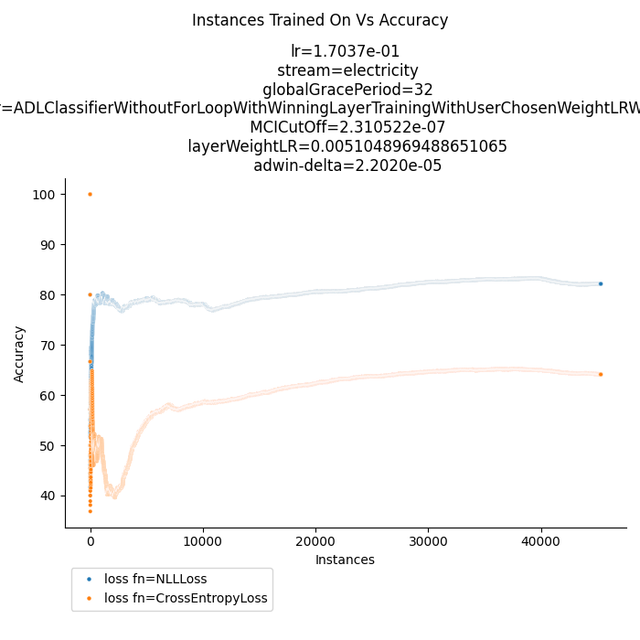

# Wir haben die falsche Loss function verwendet?
## Aus der Pytorch Dokumentation:  
**The input is expected to contain the unnormalized logits for each class**
### der unreduzierte Cross Entropy Loss:
  
Default ist reduction = mean:  
   
**Note that this case is equivalent to applying LogSoftmax on an input, followed by NLLLoss**  
  
ADL wendet einen Softmax bereits im Forward Pass an, daher ist CrossEntropy vielleicht nicht die geeigneteste Loss Funktion.  
  
## Vorschlag einer neuen Loss Funktion:
```python
import torch
from torch import nn
nr_of_classes, idx_of_true_class = 4, 1

y_pred: torch.Tensor = torch.rand(nr_of_classes)
y_true: torch.Tensor = torch.tensor(idx_of_true_class, dtype=torch.int)
nn.NLLLoss()(torch.log(y_pred), y_true)
```
## Vergleich der alten gegen die neue Loss Funktion für ein Set an Hyperparametern:  
  

  
# Decoupeling von Learning Rate und Weight Correction Factor um LR zu senken?
## Vergleich best LR Coupled vs Best LR Decoupled


# Syntetic Streams Build:
## Type of Streams:  
  
|                 Type | Agrawal | SEA | details                                                                                                                     |  
|---------------------:|:-------:|:---:|:----------------------------------------------------------------------------------------------------------------------------|  
|             no drift |    y    |  y  | Function 1                                                                                                                  |  
|            one drift |    y    |  y  | Function 1 -> abrupt drift @ 5000 -> Function 3                                                                             |  
|         three drifts |    y    |  y  | Function 1 -> abrupt drift @ 5000 -> Function 3 -> abrupt drift @ 10000 -> Function 4 -> abrupt drift @ 15000 -> Function 1 |  
| drift back and forth |    y    |  y  | Function 1 -> abrupt drift @ 5000 -> Function 3 -> abrupt drift @ 10000 -> Function 1                                       |  

## Results for ADL on Types of Streams  

|                 Type | Agrawal |  SEA   |
|---------------------:|:--------|:------:|
|             no drift | 53.3%   | 54.06% |  
|            one drift | 53.54%  | 82.00% | 
|         three drifts | 56.68%  | 80.95% |
| drift back and forth | 65.71%  | 81.1%  |

# Suchraum einschränken:
## 1. Versuch: einfach jeweils die drei Parameter nehmen die am besten auf EletricityTiny performed haben und sie auf Electricity testen:
### Lr:
- LinearLearningRateProgression(initial_learning_rate=1, decay_alpha=0.001)
- ExponentialLearningRateProgression(initial_learning_rate=1, decay_alpha=0.001)
- 5e-1
- 5e-2
- 1e-3
> 4 Werte weil mir eigentlich alle werte außer den letzen beiden zu hoch sind.
### MCI:
- 1e-6
- 1e-7
- 1e-8
> in tiny haben wir damit immer so um die 6-10 activen layer am Ende gehabt
### adwin-delta:
- 1e-3
- 1e-5
- 1e-7
### grace period per layer
- 4
- 8
- 16?
- None
> finding aus der isolation: je höher die grace period, desto schlechter das ergebnis
> und per layer out-performed global nach dem ich global auch anwende #-.-  
> es kann sein, dass auf mehr instanzen größere grace periods sinn machen bzw positive sind,
> weil auf den kleinen datastreams haben wir ja anscheinend nur das problem nicht schnell genug lernen zu können
> Grace Period None: Sieht sehr lange Trainingszeiten, habe ich dann erstmal zu grace period=1 gemacht.

# Ray Tunes:  
kein Grid Search mehr, sondern Probing:  
## 1. Suchraum:  
- maximal 50000  
- frühester abbruch nach = 500  
- anzahl stichproben = 500  
- learner: (vectorized, winning_layer, decoupled_lrs)  
- stream: only one stream at a time  
- lr: tune.loguniform(1e-4, 5e-1)  
- layer_weight_learning_rate: tune.loguniform(1e-4, 5e-1),  
- adwin-delta: tune.loguniform(1e-7, 1e-3),  
- mci: tune.loguniform(1e-7, 1e-5),  
- loss_fn: NLLLoss  
- grace_period: choice aus: global/layer/none in 4,8,16,32  

### Ergebniss des ersten Suchraums:

- lr: 0.17037433308206834,
- layer_weight_learning_rate: 0.0051048969488651065,
- adwin-delta: 2.2019797256079463e-05,
- mci: 2.3105218391180886e-07,
- grace_period": global, 32  
  
=> 82.15% acc bei 6 hidden, 6 active, und 1502 nodes in hidden layern bei 45000 instancen


### These: min_runs=500 zu niedrig, bestraft anfänglich langsame lerner

> Nachteil von hohem min_run: suchen dauern sehr lange  
> exemplarisch für Electricity

[//]: #todo: (run mit min_run=4000 für electricity again und höherer LR im Suchraum -.-)

## 2. Suchraum:
- maximal 50000
- frühester abbruch nach = 500
- anzahl stichproben = 500
- learner: (vectorized, winning_layer, decoupled_lrs)
- stream: only one stream at a time
- lr: tune.loguniform(1e-4, **5e-2**), (habe die obere grenze extra niedriger gesetzt um lr zu bekommen die gut sind)
- layer_weight_learning_rate: tune.loguniform(1e-4, **5e-2**),
- adwin-delta: tune.loguniform(1e-7, 1e-3),
- mci: tune.loguniform(1e-7, 1e-5),
- loss_fn: NLLLoss
- grace_period: choice aus: global/layer/1 in 4,8,16,32

### Ergebnisse aus 2. Suchraum:
> vgl tabelle bei streams
> beste hyperparameter:

für electricity:
```python
{
    "learner": [
        "vectorized",
        "winning_layer",
        "decoupled_lrs"
    ],
    "stream": "electricity",
    "lr": 0.03759834306496821,
    "layer_weight_learning_rate": 0.0037788154914272006,
    "adwin-delta": 0.0009280964263786628,
    "mci": 7.631027908752775e-06,
    "grace_period": [
        8,
        "layer_grace"
    ],
    "loss_fn": "NLLLoss"
}
```

<table border="1">
    <thead>
        <tr>
            <th>Type</th>
            <th colspan="5">Agrawal</th>
            <th colspan="5">SEA</th>
        </tr>
        <tr>
            <th></th>
            <th>lr</th>
            <th>Layer Weight Learning Rate</th>
            <th>Adwin Delta</th>
            <th>MCI</th>
            <th>Grace Period</th>
            <th>lr</th>
            <th>Layer Weight Learning Rate</th>
            <th>Adwin Delta</th>
            <th>MCI</th>
            <th>Grace Period</th>
        </tr>
    </thead>
    <tbody>
        <tr>
            <td>no drift</td>
            <td>0.001</td>
            <td>0.013</td>
            <td>3.79e-05</td>
            <td>6.8e-07</td>
            <td>null</td>
            <td>0.001</td>
            <td>0.02</td>
            <td>4.7e-07</td>
            <td>1.2e-06</td>
            <td>null</td>
        </tr>
        <tr>
            <td>one drift</td>
            <td>0.0007</td>
            <td>0.0008</td>
            <td>1.43e-06</td>
            <td>2.48e-07</td>
            <td>(8, global)</td>
            <td>0.039</td>
            <td>0.027</td>
            <td>4.14e-07</td>
            <td>9.6e-06</td>
            <td>(8, global)</td>
        </tr>
        <tr>
            <td>three drifts</td>
            <td>0.04</td>
            <td>0.0001</td>
            <td>1.77e-06</td>
            <td>8.24e-07</td>
            <td>(4, layer)</td>
            <td>0.039</td>
            <td>0.027</td>
            <td>4.14e-07</td>
            <td>9.6e-06</td>
            <td>(8, global)</td>
        </tr>
        <tr>
            <td>drift back and forth</td>
            <td>0.023</td>
            <td>0.002</td>
            <td>0.0002</td>
            <td>1.13e-07</td>
            <td>(4, global)</td>
            <td>0.039</td>
            <td>0.027</td>
            <td>4.14e-07</td>
            <td>9.6e-06</td>
            <td>(8, global)</td>
        </tr>
    </tbody>
</table>


# Comparision Network
## Strukture
  

## Results on Electricity

Suche durch den Suchraum:
**alle kombinationen an 2er potenzen an nodes mit genau so vielen layern wie das adl netzwerk (solange die anzahl an layern kleiner als 9 ist, sonst ist space complexität zu groß)**  
```python  
from itertools import product  
from ray import tune  
import numpy as np  
  
def SimpleDNNSearchSpace(stream_name: str, nr_of_hidden_layers: int = 5, nr_of_neurons: int = 2**12):
   """
   creates a search space for the SimpleDNN model
   that has no more than nr_of_hidden_layers many linear layers
   and in total not more than 2*nr_of_neurons many nodes
   """
   if nr_of_neurons > 256:
      list_of_possible_neuron_configs = [
         list(perm)
         for h in range(1, nr_of_hidden_layers + 1)
         for perm in product(list(map(int, 2 ** np.arange(8, int(np.ceil(np.log2(nr_of_neurons))) + 1))), repeat=h)
         if np.sum(perm) <= 2**np.ceil(np.log2(nr_of_neurons))
      ]
   else:
      list_of_possible_neuron_configs = [
         list(perm)
         for h in range(1, nr_of_hidden_layers + 1)
         for perm in product(list(map(int, 2 ** np.arange(int(np.ceil(np.log2(nr_of_neurons))) + 1))), repeat=h)
         if np.sum(perm) <= 2**np.ceil(np.log2(nr_of_neurons))
      ]
   return {
      "lr": tune.loguniform(1e-4, 5e-1),
      "model_structure": tune.choice(list_of_possible_neuron_configs),
      stream: tune.grid_search([stream_name])
   }  
```  
**also nicht jedes mal die gleiche model struktur**  
lr = 0,005  
model 1 layer mit 4096 Nodes  
Acc: 85.23%  
  
## Results for ADL on Types of Streams  
Zur Erinnerung:  
  
|                 Type | Agrawal |  SEA   |
|---------------------:|:--------|:------:|
|             no drift | 53.3%   | 54.06% |  
|            one drift | 53.54%  | 82.00% | 
|         three drifts | 56.68%  | 80.95% |
| drift back and forth | 65.71%  | 81.1%  |
  
## Result for Comparision Network  
|                 Type | Agrawal |   SEA  |
|---------------------:|:--------|:------:|
|             no drift | 58,19%  | 57.57% |  
|            one drift | 54.53%  | 84.25% | 
|         three drifts | 64.31%  | 83.94% |
| drift back and forth | 65.584% | 83.61% |
  
  
# Hidden layers Disablen:
## Einfacher Weg:
```python
from torch import nn
nr_of_inputs, nr_of_nodes = 3, 4

nn.Linear(nr_of_inputs, nr_of_nodes).requires_grad_(False)
```
Für alle Hidden layer die gelöscht werden.
ohne Gradient keine Berechnung von Backward
aber im Forward immer noch anwendung der Matrixmultiplikation und der Sigmoidfunction

implementiert in :
```python
from ADLClassifier.BaseClassifier import ADLClassifier


def disabeling_deleted_layers(adl_classifier: type(ADLClassifier)) -> type(ADLClassifier):
   """
   extends an existing ADLClassifier class 
   to disable the gradiant calculation for the corresponding hidden layer
   if an output layer is deleted
   :param adl_classifier: the class of ADL Classifier that should be extended
   :return: the extended ADLClassifier class
   """

   class DisabelingDeletedLayersWrapper(adl_classifier):
      """
      :arg class of ADLClassifier that sets requires_grad to False for hidden layers whose output layer has been deleted
      """

      def __str__(self):
         return f"{super().__str__()}WithDisabledDeletedLayers"

      @classmethod
      def name(cls) -> str:
         return f"{adl_classifier.name()}WithDisabledDeletedLayers"

      def _delete_layer(self, layer_index: int) -> bool:
         if super()._delete_layer(layer_index):
            self.model.layers[layer_index].requires_grad_(False)
            return True
         else:
            return False

   DisabelingDeletedLayersWrapper.__name__ = f"{adl_classifier.__name__}WithDisabledDeletedLayers"
   return DisabelingDeletedLayersWrapper
```
## Proposal:


implementiert in:
```python
from ADLClassifier import ADLClassifier


def delete_deleted_layers(adl_classifier: type(ADLClassifier)) -> type(ADLClassifier):
   """
   extends an existing ADLClassifier class 
   to disable the gradiant calculation for the corresponding hidden layer
   if an output layer is deleted
   :param adl_classifier: the class of ADL Classifier that should be extended
   :return: the extended ADLClassifier class
   """

   class DeleteDeletedLayersWrapper(adl_classifier):
      """
      :arg class of ADLClassifier that sets requires_grad to False for hidden layers whose output layer has been deleted
      """

      def __str__(self):
         return f"{super().__str__()}WithDeleteDeletedLayers"

      @classmethod
      def name(cls) -> str:
         return f"{adl_classifier.name()}WithDeleteDeletedLayers"

      def _delete_layer(self, layer_index: int) -> bool:
         # not exactly the same output, as we remove a sigmoid function between both layers in the forward stack
         if super()._delete_layer(layer_index):
            self.model.delete_hidden_layer(layer_index)
            return True
         else:
            return False

   DeleteDeletedLayersWrapper.__name__ = f"{adl_classifier.__name__}WithDeleteDeletedLayers"
   return DeleteDeletedLayersWrapper
```
sowie: 
```python
from typing import List, Dict, Optional, Tuple

import numpy as np
import torch
from torch import nn


class AutoDeepLearner(nn.Module):

    def delete_hidden_layer(self, layer_index: int) -> None:
        """
        deletes a hidden layer whose output layer was deleted beforehand
        :param layer_index: the index of the hidden layer to delete
        """
        # make sure that there is another layer
        assert len(self.layers) > 1, "there needs to be at least another layer to delete a hidden layer"
        assert not self.output_layer_with_index_exists(layer_index), "cannot delete a hidden layer of an active output layer"

        layer_to_delete: nn.Module = self.layers[layer_index]
        # merge two layers and take the place of the second layer:
        if layer_index == len(self.layers) - 1:
            # if last layer is deleted just delete the layer, no need to merge anything
            pass

        else:
            # if not first layer is deleted merge with layer in after it
            layer_to_merge_with: nn.Module = self.layers[layer_index + 1]
            new_weight = nn.Parameter(layer_to_merge_with.weight.matmul(layer_to_delete.weight))
            new_bias = nn.Parameter(layer_to_merge_with.bias + layer_to_merge_with.weight.matmul(layer_to_delete.bias))
            new_layer = nn.Linear(layer_to_delete.in_features, layer_to_merge_with.out_features)
            new_layer.weight = new_weight
            new_layer.bias = new_bias
            self.layers[layer_index + 1] = new_layer

        # remove now merged layer
        self.layers.pop(layer_index)

        # update all keys of all weights, all output keys and all weight_correction_factors
        # for all active layers that follow the deleted layer:
        for active_key in self.active_layer_keys()[self.active_layer_keys() > layer_index].detach().numpy().astype(int):
            self.__set_output_layer(active_key - 1, self.__pop_output_layer(active_key))
            self.__set_voting_weight(active_key - 1, self.__pop_voting_weight(active_key))
            self.__set_weight_correction_factor(active_key - 1, self.__pop_weight_correction_factor(active_key))
```  

# Ergebnisse des disablen von hidden layern:
keine zeit mehr für runs gehabt
## Accuracy Changes

[//]: #todo: (run best electricity mit neuem classifier run=1 and enable emission tracking)  
[//]: #todo: (add comparision plot here)
## Emission Changes
[//]: #todo: (rerun best electricity mit emsission tracking enabled run=1)

[//]: #todo: (add comparision of co2 here)

# Notizen:
1. Wenn Concept Change passiert macht eine Learning Rate Progression nur Sinn wenn sie dann wieder von vorne beginnt  
   -> Future Work (nach dem 20.03.)
2. Future Work: Write Capymoa classifier that runs the Matlab Implementation (for benchmarking reasons)


# mitschriften:
ray tune: search alg: hyper opt ?
hyperparameter search: im stream learning, 
streams müssen auch größere anzahl instanzen providen
agrawal one hot encoden noch nicht in capymoa, schema -> wertebereich -> is nominal, und > 2,
und normalisieren: bereits implementierit in capymoa feature standardisation
größere grace periods auf mehr instanzen


emissionen/accuracy von unterschiedlichen hyperparametern vergleichen (grace period, mci, delta) jeweils nur eines ändern.

mogon: java optionen angeben, job array, 